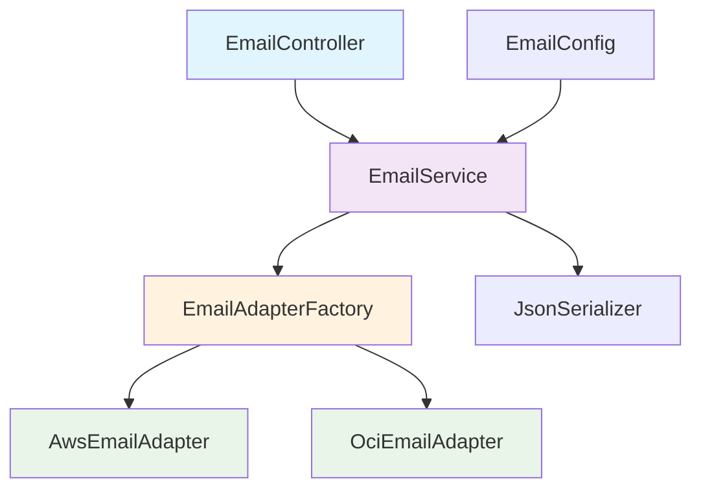

# 📧 Email Service API

[](https://www.oracle.com/java/)
[](https://spring.io/projects/spring-boot)
[](https://maven.apache.org/)
[](https://www.docker.com/)
[](https://opensource.org/licenses/MIT)

## Sobre o Projeto

O **Email Service API** é uma aplicação REST desenvolvida para o desafio técnico da Viasoft. A aplicação processa dados de email e os adapta automaticamente para diferentes provedores de nuvem (AWS e OCI) baseado em configuração, sem necessidade de alterar o objeto de entrada.

### 🎯 Principais Funcionalidades

- ✅ **API REST** com endpoint único para processamento de emails
- ✅ **Adaptação automática** para provedores AWS e OCI via configuração
- ✅ **Validação robusta** de dados com Bean Validation
- ✅ **Serialização JSON** e impressão no console
- ✅ **Tratamento de erros** centralizado e padronizado
- ✅ **Documentação OpenAPI/Swagger** completa
- ✅ **Arquitetura extensível** seguindo princípios SOLID
- ✅ **Testes unitários** com alta cobertura
- ✅ **Containerização Docker** para deploy simplificado
- ✅ **Monitoramento** com Spring Boot Actuator
- ✅ **Qualidade de código** com JaCoCo, SpotBugs e Checkstyle

### 🏗️ Arquitetura

A aplicação segue os princípios de **Clean Architecture** e **SOLID**, utilizando os seguintes **Design Patterns**:

- **Adapter Pattern**: Para adaptação entre diferentes formatos de dados
- **Factory Pattern**: Para criação dinâmica de adaptadores
- **Strategy Pattern**: Para seleção de provedor baseada em configuração
- **Dependency Injection**: Para inversão de controle



## 🛠️ Tecnologias Utilizadas

### Backend
- **Java 17** - Linguagem de programação
- **Spring Boot 3.5.3** - Framework principal
- **Spring Web** - Para criação da API REST
- **Spring Validation** - Para validação de dados
- **Spring Boot Actuator** - Monitoramento e métricas
- **Maven** - Gerenciamento de dependências

### Documentação
- **SpringDoc OpenAPI 2.8.8** - Documentação automática da API (Swagger)
- **JavaDoc** - Documentação do código

### Testes e Qualidade
- **JUnit 5** - Framework de testes
- **Mockito** - Mocks para testes unitários
- **Spring Boot Test** - Testes de integração
- **JaCoCo 0.8.12** - Cobertura de código (mínimo 80%)
- **SpotBugs 4.8.6** - Análise estática de código
- **Checkstyle** - Verificação de padrões de código

### DevOps e Deploy
- **Docker** - Containerização da aplicação
- **Docker Compose** - Orquestração de containers
- **Multi-stage builds** - Otimização de imagens Docker

### Utilitários
- **Jackson** - Serialização/deserialização JSON
- **SLF4J** - Sistema de logging
- **Bean Validation** - Validação de dados

## 📁 Estrutura do Projeto

```
email-service/
├── pom.xml                           # ← Configuração Maven principal
├── README.md                         # ← Documentação do projeto
│
├── 📁 .docker/                       # ← PASTA DE CONTAINERIZAÇÃO
│   ├── Dockerfile                    # ← Imagem Docker principal
│   ├── Dockerfile.optimized          # ← Versão otimizada com cache
│   ├── docker-compose.yml            # ← Orquestração para desenvolvimento
│   ├── docker-compose.prod.yml       # ← Orquestração para produção
│   ├── .dockerignore                 # ← Arquivos ignorados pelo Docker
│   ├── build.sh                      # ← Script para construir imagem
│   ├── run.sh                        # ← Script para executar container
│   ├── deploy.sh                     # ← Script para deploy em produção
│   ├── stop.sh                       # ← Script para parar containers
│   ├── nginx.conf                    # ← Configuração Nginx (opcional)
│   └── Makefile                      # ← Comandos automatizados (opcional)
│
├── �� logs/                          # ← Diretório de logs (criado automaticamente)
│   └── email-service.log
│
├── src/
│   ├── main/
│   │   ├── java/
│   │   │   └── com/
│   │   │       └── viasoft/
│   │   │           └── emailservice/
│   │   │               ├── EmailServiceApplication.java
│   │   │               ├── adapter/
│   │   │               │   ├── EmailAdapter.java
│   │   │               │   ├── factory/
│   │   │               │   │   └── EmailAdapterFactory.java
│   │   │               │   └── impl/
│   │   │               │       ├── AwsEmailAdapter.java
│   │   │               │       └── OciEmailAdapter.java
│   │   │               ├── config/
│   │   │               │   └── EmailConfig.java
│   │   │               ├── controller/
│   │   │               │   └── EmailController.java
│   │   │               ├── dto/
│   │   │               │   ├── EmailAwsDTO.java
│   │   │               │   ├── EmailOciDTO.java
│   │   │               │   └── EmailRequestDTO.java
│   │   │               ├── enums/
│   │   │               │   └── EmailProvider.java
│   │   │               ├── exception/
│   │   │               │   ├── EmailProcessingException.java
│   │   │               │   ├── InvalidEmailDataException.java
│   │   │               │   └── handler/
│   │   │               │       └── GlobalExceptionHandler.java
│   │   │               ├── service/
│   │   │               │   ├── EmailService.java
│   │   │               │   └── impl/
│   │   │               │       └── EmailServiceImpl.java
│   │   │               └── util/
│   │   │                   └── JsonSerializer.java
│   │   └── resources/
│   │       ├── application.properties      # ← Configuração padrão
│   │       └── application-docker.yml      # ← Configuração para Docker
│   └── test/
│       └── java/
│           └── com/
│               └── viasoft/
│                   └── emailservice/
│                       ├── adapter/
│                       ├── controller/
│                       └── service/
└── target/                           # ← Gerado pelo Maven
    ├── email-service-0.0.1-SNAPSHOT.jar
    └── site/jacoco/index.html
```

## 🚀 Como Executar o Projeto

### Pré-requisitos

Certifique-se de ter instalado em sua máquina:

- **Java 17** ou superior
- **Maven 3.6** ou superior
- **Docker** (opcional, para containerização)
- **Docker Compose** (opcional)
- **Git** (para clonar o repositório)

### Verificando as Versões

```bash
# Verificar versão do Java
java -version

# Verificar versão do Maven
mvn -version

# Verificar versão do Docker
docker --version

# Verificar versão do Git
git --version
```

### Clonando o Repositório

```bash
# Clonar o repositório
git clone <repository-url>

# Navegar para o diretório do projeto
cd email-service
```

### Configuração

1. **Configurar o Provedor de Email**

   Edite o arquivo `src/main/resources/application.properties`:

   ```properties
   # Para usar AWS
   mail.integracao=AWS

   # Para usar OCI
   mail.integracao=OCI
   ```

2. **Outras Configurações Disponíveis**

   ```properties
   # Porta da aplicação (padrão: 8080)
   server.port=8080

   # Context path da aplicação
   server.servlet.context-path=/api/v1

   # Nível de log
   logging.level.com.viasoft.emailservice=DEBUG
   ```

### Opção 1: Execução Tradicional com Maven

#### Usando Maven Wrapper (Recomendado)

```bash
# Dar permissão de execução (Linux/Mac)
chmod +x mvnw

# Compilar o projeto
./mvnw clean compile

# Executar os testes
./mvnw test

# Executar a aplicação
./mvnw spring-boot:run
```

#### Usando Maven Instalado

```bash
# Compilar o projeto
mvn clean compile

# Executar os testes
mvn test

# Executar a aplicação
mvn spring-boot:run
```

#### Gerando JAR e Executando

```bash
# Gerar o JAR
mvn clean package

# Executar o JAR gerado
java -jar target/email-service-0.0.1-SNAPSHOT.jar
```

### Opção 2: Execução com Docker 🐳

#### Usando Docker Compose (Recomendado)

```bash
# Construir e executar
docker-compose -f .docker/docker-compose.yml up -d

# Ver logs
docker-compose -f .docker/docker-compose.yml logs -f email-service

# Parar serviços
docker-compose -f .docker/docker-compose.yml down
```

#### Usando Scripts de Automação

```bash
# Tornar scripts executáveis
chmod +x .docker/*.sh

# Construir imagem
.docker/build.sh

# Executar aplicação
.docker/run.sh

# Parar aplicação
.docker/stop.sh
```

#### Usando Docker Diretamente

```bash
# Construir imagem
docker build -f .docker/Dockerfile -t viasoft/email-service:latest .

# Executar container
docker run -d \
--name email-service \
-p 8080:8080 \
-e SPRING_PROFILES_ACTIVE=docker \
viasoft/email-service:latest

# Ver logs
docker logs -f email-service
```

#### Usando Makefile (Opcional)

```bash
# Navegar para pasta .docker
cd .docker

# Ver comandos disponíveis
make help

# Executar comandos
make build
make run
make logs
make stop
```

### Verificando se a Aplicação Está Rodando

Após iniciar a aplicação, você verá logs similares a:

```
2024-01-15 10:30:00 - Started EmailServiceApplication in 3.245 seconds
2024-01-15 10:30:00 - Tomcat started on port(s): 8080 (http)
```

**Endpoints de Verificação:**
- **Health Check**: http://localhost:8080/actuator/health
- **Swagger UI**: http://localhost:8080/swagger-ui.html
- **Métricas**: http://localhost:8080/actuator/metrics

## 📖 Documentação da API

### Swagger UI

Após iniciar a aplicação, acesse a documentação interativa:

**URL:** http://localhost:8080/swagger-ui.html

### Endpoints Disponíveis

#### 1. Processar Email

**POST** `/emails/send`

Processa dados de email e adapta para o provedor configurado.

**Request Body:**
```json
{
    "emailDestinatario": "destinatario@exemplo.com",
    "nomeDestinatario": "João Silva",
    "emailRemetente": "remetente@exemplo.com",
    "assunto": "Bem-vindo ao nosso sistema",
    "conteudo": "Olá João! Seja bem-vindo ao nosso sistema."
}
```

**Responses:**
- `204 No Content` - Email processado com sucesso
- `400 Bad Request` - Dados inválidos
- `500 Internal Server Error` - Erro interno

#### 2. Health Check

**GET** `/actuator/health`

Verifica se a aplicação está funcionando.

**Response:**
```json
{
  "status": "UP"
}
```

### Validações de Entrada

| Campo | Validações |
|-------|------------|
| `emailDestinatario` | Obrigatório, formato de email válido, máximo 45 caracteres |
| `nomeDestinatario` | Obrigatório, máximo 60 caracteres |
| `emailRemetente` | Obrigatório, formato de email válido, máximo 45 caracteres |
| `assunto` | Obrigatório, máximo 120 caracteres |
| `conteudo` | Obrigatório, máximo 256 caracteres |

### Diferenças entre Provedores

#### AWS (Amazon Web Services)
```json
{
    "recipient": "destinatario@exemplo.com",
    "recipientName": "João Silva",
    "sender": "remetente@exemplo.com",
    "subject": "Bem-vindo ao nosso sistema",
    "content": "Olá João! Seja bem-vindo ao nosso sistema."
}
```

#### OCI (Oracle Cloud Infrastructure)
```json
{
    "recipientEmail": "destinatario@exemplo.com",
    "recipientName": "João Silva",
    "senderEmail": "remetente@exemplo.com",
    "subject": "Bem-vindo ao nosso sistema",
    "body": "Olá João! Seja bem-vindo ao nosso sistema."
}
```

## 🧪 Testando a Aplicação

### Usando cURL

#### Teste com Dados Válidos
```bash
curl -X POST http://localhost:8080/emails/send \
  -H "Content-Type: application/json" \
  -d '{
    "emailDestinatario": "teste@exemplo.com",
    "nomeDestinatario": "João Silva",
    "emailRemetente": "remetente@exemplo.com",
    "assunto": "Teste de Email",
    "conteudo": "Este é um teste do sistema de emails."
  }'
```

#### Teste com Email Inválido
```bash
curl -X POST http://localhost:8080/emails/send \
  -H "Content-Type: application/json" \
  -d '{
    "emailDestinatario": "email-invalido",
    "nomeDestinatario": "João Silva",
    "emailRemetente": "remetente@exemplo.com",
    "assunto": "Teste",
    "conteudo": "Conteúdo do teste."
  }'
```

### Executando Testes Unitários

```bash
# Executar todos os testes
mvn test

# Executar testes com relatório de cobertura
mvn test jacoco:report

# Executar análise de qualidade completa
mvn clean verify

# Executar testes de uma classe específica
mvn test -Dtest=EmailControllerTest
```

### Verificando Cobertura de Testes

Após executar os testes com Jacoco:

```bash
# Abrir relatório de cobertura
open target/site/jacoco/index.html
```

## 🔍 Qualidade de Código

### JaCoCo - Cobertura de Código

- **Cobertura mínima**: 80% por pacote
- **Relatório**: `target/site/jacoco/index.html`

```bash
# Executar análise de cobertura
mvn clean test jacoco:report
```

### SpotBugs - Análise Estática

- **Configuração**: Esforço máximo, threshold baixo
- **Relatório**: `target/spotbugsXml.xml` e `target/spotbugs.html`

```bash
# Executar SpotBugs
mvn spotbugs:check
```

### Checkstyle - Padrões de Código

- **Configuração**: sun_checks.xml
- **Execução**: Fase de validação

```bash
# Executar Checkstyle
mvn checkstyle:check
```

## 🐳 Docker - Guia Completo

### Estrutura de Arquivos Docker

```
.docker/
├── Dockerfile                 # Imagem principal
├── Dockerfile.optimized       # Versão otimizada com cache
├── docker-compose.yml         # Orquestração para desenvolvimento
├── docker-compose.prod.yml    # Orquestração para produção
├── .dockerignore             # Arquivos ignorados
├── build.sh                  # Script de build
├── run.sh                    # Script de execução
├── deploy.sh                 # Script de deploy
├── stop.sh                   # Script para parar
├── nginx.conf                # Configuração Nginx (opcional)
└── Makefile                  # Comandos automatizados (opcional)
```

### Comandos Docker Úteis

```bash
# Construir imagem
docker build -f .docker/Dockerfile -t viasoft/email-service:latest .

# Construir sem cache
docker build --no-cache -f .docker/Dockerfile -t viasoft/email-service:latest .

# Executar interativamente
docker run -it --rm -p 8080:8080 viasoft/email-service:latest

# Acessar container em execução
docker exec -it email-service /bin/bash

# Ver métricas do container
docker stats email-service

# Ver logs do container
docker logs -f email-service
```

### Configurações de Ambiente Docker

O arquivo `application-docker.yml` contém configurações específicas para ambiente containerizado:

- Graceful shutdown habilitado
- Health checks configurados
- Logs otimizados para containers
- Métricas expostas

### Health Checks Docker

O container inclui health checks automáticos:

```bash
# Verificar saúde do container
docker inspect --format='{{.State.Health.Status}}' email-service
```

## 🔄 Mudando de Provedor

### Durante a Execução

1. **Parar a aplicação** (Ctrl+C ou `docker-compose down`)

2. **Alterar configuração** em `application.properties`:
   ```properties
   # Mudar de AWS para OCI
   mail.integracao=OCI
   ```

3. **Reiniciar a aplicação**

### Via Variável de Ambiente

```bash
# Maven
MAIL_INTEGRACAO=AWS mvn spring-boot:run

# Docker
docker run -e MAIL_INTEGRACAO=OCI -p 8080:8080 viasoft/email-service:latest

# Docker Compose
MAIL_INTEGRACAO=OCI docker-compose -f .docker/docker-compose.yml up
```

## 📊 Monitoramento e Logs

### Spring Boot Actuator

Endpoints disponíveis:

- `/actuator/health` - Status da aplicação
- `/actuator/info` - Informações da aplicação
- `/actuator/metrics` - Métricas de performance
- `/actuator/prometheus` - Métricas para Prometheus

### Logs da Aplicação

A aplicação gera logs estruturados que incluem:

- **INFO**: Processamento de emails e operações principais
- **DEBUG**: Detalhes técnicos e fluxo de dados
- **WARN**: Validações e problemas não críticos
- **ERROR**: Erros de processamento e exceções

### Exemplo de Saída no Console

```
2024-01-15 10:35:22 - Iniciando processamento de email para: teste@exemplo.com
2024-01-15 10:35:22 - Provedor configurado: AWS
2024-01-15 10:35:22 - Adaptador criado: AwsEmailAdapter
2024-01-15 10:35:22 - Dados adaptados com sucesso

=== EMAIL PROCESSADO ===
Provedor: AWS
JSON Serializado:
{
"recipient": "teste@exemplo.com",
"recipientName": "João Silva",
"sender": "remetente@exemplo.com",
"subject": "Teste de Email",
"content": "Este é um teste do sistema de emails."
}
========================
```

## 🐛 Solução de Problemas

### Problemas Comuns

#### 1. Erro de Porta em Uso
```
Port 8080 was already in use
```

**Solução:**
```bash
# Alterar porta no application.properties
server.port=8081

# Ou usar variável de ambiente
SERVER_PORT=8081 mvn spring-boot:run

# Docker
docker run -p 8081:8080 viasoft/email-service:latest
```

#### 2. Erro de Versão do Java
```
Unsupported class file major version
```

**Solução:**
- Verificar se está usando Java 17 ou superior
- Configurar JAVA_HOME corretamente

#### 3. Erro de Dependências Maven
```
Could not resolve dependencies
```

**Solução:**
```bash
# Limpar cache do Maven
mvn dependency:purge-local-repository

# Baixar dependências novamente
mvn clean install
```

#### 4. Problemas com Docker

```bash
# Limpar containers parados
docker container prune

# Limpar imagens não utilizadas
docker image prune

# Reconstruir sem cache
docker-compose -f .docker/docker-compose.yml build --no-cache
```

### Logs de Debug

Para ativar logs mais detalhados:

```properties
# application.properties
logging.level.com.viasoft.emailservice=DEBUG
logging.level.org.springframework.web=DEBUG
```

## 🚀 Deploy em Produção

### Gerando JAR para Produção

```bash
# Gerar JAR otimizado
mvn clean package -DskipTests

# JAR será gerado em target/email-service-0.0.1-SNAPSHOT.jar
```

### Executando em Produção

```bash
# Executar com perfil de produção
java -jar -Dspring.profiles.active=prod target/email-service-0.0.1-SNAPSHOT.jar

# Com configurações customizadas
java -jar \
-Dserver.port=8080 \
-Dmail.integracao=AWS \
-Dlogging.level.com.viasoft.emailservice=INFO \
target/email-service-0.0.1-SNAPSHOT.jar
```

### Deploy com Docker

```bash
# Deploy usando script automatizado
.docker/deploy.sh

# Ou manualmente com Docker Compose
docker-compose -f .docker/docker-compose.prod.yml up -d --build

# Verificar status
docker-compose -f .docker/docker-compose.prod.yml ps
```

## 🤝 Contribuindo

### Adicionando Novo Provedor

Para adicionar um novo provedor (ex: Google Cloud):

1. **Criar DTO específico**:
   ```java
   public class EmailGoogleDTO {
       private String to;
       private String from;
       private String subject;
       private String message;
       // getters e setters
   }
   ```

2. **Implementar Adapter**:
   ```java
   @Component
   public class GoogleEmailAdapter implements EmailAdapter<EmailGoogleDTO> {
   @Override
   public EmailGoogleDTO adapt(EmailRequestDTO request) {
   // lógica de adaptação
   }

       @Override
       public String getProviderType() {
           return EmailProvider.GOOGLE.getValue();
       }
   }
   ```

3. **Atualizar Enum**:
   ```java
   public enum EmailProvider {
       AWS("AWS"),
       OCI("OCI"),
       GOOGLE("GOOGLE");
   }
   ```

### Padrões de Código

- Seguir convenções Java
- Usar JavaDoc em métodos públicos
- Implementar testes unitários
- Seguir princípios SOLID
- Manter cobertura de testes acima de 80%

## Licença

Este projeto está licenciado sob a Licença MIT - veja o arquivo [LICENSE](LICENSE) para detalhes.

## 👥 Autor

**Desenvolvido para o Desafio Técnico Viasoft**

- GitHub: [https://github.com/thgbianeck](https://github.com/thgbianeck)
- LinkedIn: [https://www.linkedin.com/in/thiagobianeck/](https://www.linkedin.com/in/thiagobianeck/)
- Email: thiagobianeck@gmail.com

## 📞 Suporte

Para dúvidas ou problemas:

1. Verifique a seção [Solução de Problemas](#-solução-de-problemas)
2. Consulte os logs da aplicação
3. Verifique a documentação da API no Swagger
4. Abra uma issue no repositório

---

**⭐ Se este projeto foi útil, considere dar uma estrela no repositório!**