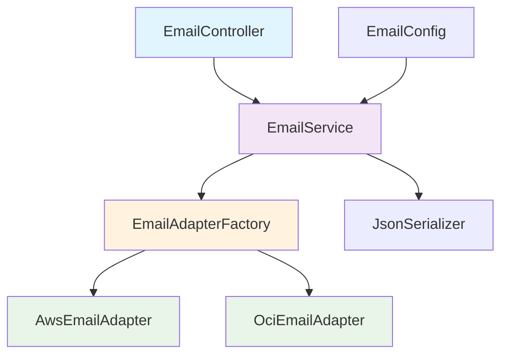

# 📧 Email Service API

[](https://www.oracle.com/java/)
[](https://spring.io/projects/spring-boot)
[](https://maven.apache.org/)
[](https://opensource.org/licenses/MIT)

## Sobre o Projeto

O **Email Service API** é uma aplicação REST desenvolvida para o desafio técnico da Viasoft. A aplicação processa dados de email e os adapta automaticamente para diferentes provedores de nuvem (AWS e OCI) baseado em configuração, sem necessidade de alterar o objeto de entrada.

### 🎯 Principais Funcionalidades

- ✅ **API REST** com endpoint único para processamento de emails
- ✅ **Adaptação automática** para provedores AWS e OCI via configuração
- ✅ **Validação robusta** de dados com Bean Validation
- ✅ **Serialização JSON** e impressão no console
- ✅ **Tratamento de erros** centralizado e padronizado
- ✅ **Documentação OpenAPI/Swagger** completa
- ✅ **Arquitetura extensível** seguindo princípios SOLID
- ✅ **Testes unitários** com alta cobertura

### 🏗️ Arquitetura

A aplicação segue os princípios de **Clean Architecture** e **SOLID**, utilizando os seguintes **Design Patterns**:

- **Adapter Pattern**: Para adaptação entre diferentes formatos de dados
- **Factory Pattern**: Para criação dinâmica de adaptadores
- **Strategy Pattern**: Para seleção de provedor baseada em configuração
- **Dependency Injection**: Para inversão de controle



## 🛠️ Tecnologias Utilizadas

### Backend
- **Java 17** - Linguagem de programação
- **Spring Boot 3.2.0** - Framework principal
- **Spring Web** - Para criação da API REST
- **Spring Validation** - Para validação de dados
- **Maven** - Gerenciamento de dependências

### Documentação
- **OpenAPI/Swagger** - Documentação automática da API
- **JavaDoc** - Documentação do código

### Testes
- **JUnit 5** - Framework de testes
- **Mockito** - Mocks para testes unitários
- **Spring Boot Test** - Testes de integração

### Utilitários
- **Jackson** - Serialização/deserialização JSON
- **SLF4J** - Sistema de logging
- **Bean Validation** - Validação de dados

## 📁 Estrutura do Projeto

```
src/
├── main/
│   ├── java/
│   │   └── com/
│   │       └── viasoft/
│   │           └── emailservice/
│   │               ├── EmailServiceApplication.java
│   │               ├── adapter/
│   │               │   ├── EmailAdapter.java
│   │               │   ├── factory/
│   │               │   │   └── EmailAdapterFactory.java
│   │               │   └── impl/
│   │               │       ├── AwsEmailAdapter.java
│   │               │       └── OciEmailAdapter.java
│   │               ├── config/
│   │               │   └── EmailConfig.java
│   │               ├── controller/
│   │               │   └── EmailController.java
│   │               ├── dto/
│   │               │   ├── EmailAwsDTO.java
│   │               │   ├── EmailOciDTO.java
│   │               │   └── EmailRequestDTO.java
│   │               ├── enums/
│   │               │   └── EmailProvider.java
│   │               ├── exception/
│   │               │   ├── EmailProcessingException.java
│   │               │   ├── InvalidEmailDataException.java
│   │               │   └── handler/
│   │               │       └── GlobalExceptionHandler.java
│   │               ├── service/
│   │               │   ├── EmailService.java
│   │               │   └── impl/
│   │               │       └── EmailServiceImpl.java
│   │               └── util/
│   │                   └── JsonSerializer.java
│   └── resources/
│       └── application.properties
└── test/
    └── java/
        └── com/
            └── viasoft/
                └── emailservice/
                    ├── adapter/
                    ├── controller/
                    └── service/
```

## 🚀 Como Executar o Projeto

### Pré-requisitos

Certifique-se de ter instalado em sua máquina:

- **Java 17** ou superior
- **Maven 3.6** ou superior
- **Git** (para clonar o repositório)

### Verificando as Versões

```bash
# Verificar versão do Java
java -version

# Verificar versão do Maven
mvn -version

# Verificar versão do Git
git --version
```

### Clonando o Repositório

```bash
# Clonar o repositório
git clone <repository-url>

# Navegar para o diretório do projeto
cd email-service
```

### Configuração

1. **Configurar o Provedor de Email**

   Edite o arquivo `src/main/resources/application.properties`:

   ```properties
   # Para usar AWS
   mail.integracao=AWS
   
   # Para usar OCI
   mail.integracao=OCI
   ```

2. **Outras Configurações Disponíveis**

   ```properties
   # Porta da aplicação (padrão: 8080)
   server.port=8080
   
   # Context path da aplicação
   server.servlet.context-path=/api/v1
   
   # Nível de log
   logging.level.com.viasoft.emailservice=DEBUG
   ```

### Compilação e Execução

#### Opção 1: Usando Maven Wrapper (Recomendado)

```bash
# Dar permissão de execução (Linux/Mac)
chmod +x mvnw

# Compilar o projeto
./mvnw clean compile

# Executar os testes
./mvnw test

# Executar a aplicação
./mvnw spring-boot:run
```

#### Opção 2: Usando Maven Instalado

```bash
# Compilar o projeto
mvn clean compile

# Executar os testes
mvn test

# Executar a aplicação
mvn spring-boot:run
```

#### Opção 3: Gerando JAR e Executando

```bash
# Gerar o JAR
mvn clean package

# Executar o JAR gerado
java -jar target/email-service-1.0.0.jar
```

### Verificando se a Aplicação Está Rodando

Após iniciar a aplicação, você verá logs similares a:

```
2024-01-15 10:30:00 - Started EmailServiceApplication in 3.245 seconds
2024-01-15 10:30:00 - Tomcat started on port(s): 8080 (http)
```

Acesse: **http://localhost:8080/api/v1/emails/health**

Resposta esperada: `Email Service está funcionando!`

## 📖 Documentação da API

### Swagger UI

Após iniciar a aplicação, acesse a documentação interativa:

**URL:** http://localhost:8080/api/v1/swagger-ui.html

### Endpoints Disponíveis

#### 1. Processar Email

**POST** `/api/v1/emails/send`

Processa dados de email e adapta para o provedor configurado.

**Request Body:**
```json
{
    "emailDestinatario": "destinatario@exemplo.com",
    "nomeDestinatario": "João Silva",
    "emailRemetente": "remetente@exemplo.com",
    "assunto": "Bem-vindo ao nosso sistema",
    "conteudo": "Olá João! Seja bem-vindo ao nosso sistema."
}
```

**Responses:**
- `204 No Content` - Email processado com sucesso
- `400 Bad Request` - Dados inválidos
- `500 Internal Server Error` - Erro interno

#### 2. Health Check

**GET** `/api/v1/emails/health`

Verifica se a aplicação está funcionando.

**Response:**
```
Email Service está funcionando!
```

### Validações de Entrada

| Campo | Validações |
|-------|------------|
| `emailDestinatario` | Obrigatório, formato de email válido, máximo 45 caracteres |
| `nomeDestinatario` | Obrigatório, máximo 60 caracteres |
| `emailRemetente` | Obrigatório, formato de email válido, máximo 45 caracteres |
| `assunto` | Obrigatório, máximo 120 caracteres |
| `conteudo` | Obrigatório, máximo 256 caracteres |

### Diferenças entre Provedores

#### AWS (Amazon Web Services)
```json
{
    "recipient": "destinatario@exemplo.com",
    "recipientName": "João Silva",
    "sender": "remetente@exemplo.com",
    "subject": "Bem-vindo ao nosso sistema",
    "content": "Olá João! Seja bem-vindo ao nosso sistema."
}
```

**Limites:**
- `recipient`: 45 caracteres
- `recipientName`: 60 caracteres
- `sender`: 45 caracteres
- `subject`: 120 caracteres
- `content`: 256 caracteres

#### OCI (Oracle Cloud Infrastructure)
```json
{
    "recipientEmail": "destinatario@exemplo.com",
    "recipientName": "João Silva",
    "senderEmail": "remetente@exemplo.com",
    "subject": "Bem-vindo ao nosso sistema",
    "body": "Olá João! Seja bem-vindo ao nosso sistema."
}
```

**Limites:**
- `recipientEmail`: 40 caracteres
- `recipientName`: 50 caracteres
- `senderEmail`: 40 caracteres
- `subject`: 100 caracteres
- `body`: 250 caracteres

## 🧪 Testando a Aplicação

### Usando cURL

#### Teste com Dados Válidos
```bash
curl -X POST http://localhost:8080/api/v1/emails/send \
  -H "Content-Type: application/json" \
  -d '{
    "emailDestinatario": "teste@exemplo.com",
    "nomeDestinatario": "João Silva",
    "emailRemetente": "remetente@exemplo.com",
    "assunto": "Teste de Email",
    "conteudo": "Este é um teste do sistema de emails."
  }'
```

#### Teste com Email Inválido
```bash
curl -X POST http://localhost:8080/api/v1/emails/send \
  -H "Content-Type: application/json" \
  -d '{
    "emailDestinatario": "email-invalido",
    "nomeDestinatario": "João Silva",
    "emailRemetente": "remetente@exemplo.com",
    "assunto": "Teste",
    "conteudo": "Conteúdo do teste."
  }'
```

### Usando Postman

1. **Importar Collection**
    - Acesse: http://localhost:8080/api/v1/api-docs
    - Copie o JSON e importe no Postman

2. **Configurar Requisição**
    - Método: `POST`
    - URL: `http://localhost:8080/api/v1/emails/send`
    - Headers: `Content-Type: application/json`
    - Body: JSON com dados do email

### Executando Testes Unitários

```bash
# Executar todos os testes
mvn test

# Executar testes com relatório de cobertura
mvn test jacoco:report

# Executar testes de uma classe específica
mvn test -Dtest=EmailControllerTest

# Executar testes em modo verbose
mvn test -X
```

### Verificando Cobertura de Testes

Após executar os testes com Jacoco:

```bash
# Abrir relatório de cobertura
open target/site/jacoco/index.html
```

## 🔄 Mudando de Provedor

### Durante a Execução

1. **Parar a aplicação** (Ctrl+C)

2. **Alterar configuração** em `application.properties`:
   ```properties
   # Mudar de AWS para OCI
   mail.integracao=OCI
   ```

3. **Reiniciar a aplicação**:
   ```bash
   mvn spring-boot:run
   ```

4. **Testar novamente** - o mesmo JSON de entrada será adaptado automaticamente para o formato OCI

### Via Variável de Ambiente

```bash
# Executar com AWS
MAIL_INTEGRACAO=AWS mvn spring-boot:run

# Executar com OCI
MAIL_INTEGRACAO=OCI mvn spring-boot:run
```

## 📊 Monitoramento e Logs

### Logs da Aplicação

A aplicação gera logs estruturados que incluem:

- **INFO**: Processamento de emails e operações principais
- **DEBUG**: Detalhes técnicos e fluxo de dados
- **WARN**: Validações e problemas não críticos
- **ERROR**: Erros de processamento e exceções

### Exemplo de Saída no Console

```
2024-01-15 10:35:22 - Iniciando processamento de email para: teste@exemplo.com
2024-01-15 10:35:22 - Provedor configurado: AWS
2024-01-15 10:35:22 - Adaptador criado: AwsEmailAdapter
2024-01-15 10:35:22 - Dados adaptados com sucesso

=== EMAIL PROCESSADO ===
Provedor: AWS
JSON Serializado:
{
  "recipient": "teste@exemplo.com",
  "recipientName": "João Silva",
  "sender": "remetente@exemplo.com",
  "subject": "Teste de Email",
  "content": "Este é um teste do sistema de emails."
}
========================

2024-01-15 10:35:22 - Email processado com sucesso para provedor: AWS
```

### Health Check e Métricas

Acesse: http://localhost:8080/api/v1/actuator/health

```json
{
  "status": "UP"
}
```

## 🐛 Solução de Problemas

### Problemas Comuns

#### 1. Erro de Porta em Uso
```
Port 8080 was already in use
```

**Solução:**
```bash
# Alterar porta no application.properties
server.port=8081

# Ou usar variável de ambiente
SERVER_PORT=8081 mvn spring-boot:run
```

#### 2. Erro de Versão do Java
```
Unsupported class file major version
```

**Solução:**
- Verificar se está usando Java 17 ou superior
- Configurar JAVA_HOME corretamente

#### 3. Erro de Dependências Maven
```
Could not resolve dependencies
```

**Solução:**
```bash
# Limpar cache do Maven
mvn dependency:purge-local-repository

# Baixar dependências novamente
mvn clean install
```

#### 4. Erro de Configuração de Provedor
```
Provedor de email inválido configurado: INVALID
```

**Solução:**
- Verificar se `mail.integracao` está configurado como `AWS` ou `OCI`
- Verificar se não há espaços extras na configuração

### Logs de Debug

Para ativar logs mais detalhados:

```properties
# application.properties
logging.level.com.viasoft.emailservice=DEBUG
logging.level.org.springframework.web=DEBUG
```

### Validação de Ambiente

```bash
# Verificar variáveis de ambiente
echo $JAVA_HOME
echo $MAVEN_HOME

# Verificar conectividade
curl -I http://localhost:8080/api/v1/emails/health
```

## 🔧 Configurações Avançadas

### Configurações de Logging

```properties
# Arquivo de log
logging.file.name=logs/email-service.log

# Padrão de log personalizado
logging.pattern.file=%d{yyyy-MM-dd HH:mm:ss} [%thread] %-5level %logger{36} - %msg%n

# Rotação de logs
logging.logback.rollingpolicy.max-file-size=10MB
logging.logback.rollingpolicy.max-history=30
```

### Configurações de Performance

```properties
# Configurações do Tomcat
server.tomcat.max-threads=200
server.tomcat.min-spare-threads=10

# Configurações de timeout
server.servlet.session.timeout=30m
```

### Configurações de Validação

```properties
# Configurações de validação customizadas
validation.email.max-length=45
validation.name.max-length=60
validation.subject.max-length=120
validation.content.max-length=256
```

## 🚀 Deploy em Produção

### Gerando JAR para Produção

```bash
# Gerar JAR otimizado
mvn clean package -Pprod

# JAR será gerado em target/email-service-1.0.0.jar
```

### Executando em Produção

```bash
# Executar com perfil de produção
java -jar -Dspring.profiles.active=prod target/email-service-1.0.0.jar

# Com configurações customizadas
java -jar \
  -Dserver.port=8080 \
  -Dmail.integracao=AWS \
  -Dlogging.level.com.viasoft.emailservice=INFO \
  target/email-service-1.0.0.jar
```

### Docker (Opcional)

```dockerfile
FROM openjdk:17-jdk-slim

WORKDIR /app

COPY target/email-service-1.0.0.jar app.jar

EXPOSE 8080

ENTRYPOINT ["java", "-jar", "app.jar"]
```

```bash
# Build da imagem
docker build -t email-service:1.0.0 .

# Executar container
docker run -p 8080:8080 -e MAIL_INTEGRACAO=AWS email-service:1.0.0
```

## 🤝 Contribuindo

### Adicionando Novo Provedor

Para adicionar um novo provedor (ex: Google Cloud):

1. **Criar DTO específico**:
   ```java
   public class EmailGoogleDTO {
       private String to;
       private String from;
       private String subject;
       private String message;
       // getters e setters
   }
   ```

2. **Implementar Adapter**:
   ```java
   @Component
   public class GoogleEmailAdapter implements EmailAdapter<EmailGoogleDTO> {
       @Override
       public EmailGoogleDTO adapt(EmailRequestDTO request) {
           // lógica de adaptação
       }
       
       @Override
       public String getProviderType() {
           return EmailProvider.GOOGLE.getValue();
       }
   }
   ```

3. **Atualizar Enum**:
   ```java
   public enum EmailProvider {
       AWS("AWS"),
       OCI("OCI"),
       GOOGLE("GOOGLE");
   }
   ```

4. **Configurar**:
   ```properties
   mail.integracao=GOOGLE
   ```

### Padrões de Código

- Seguir convenções Java
- Usar JavaDoc em métodos públicos
- Implementar testes unitários
- Seguir princípios SOLID
- Usar nomes descritivos

## 📄 Licença

Este projeto está licenciado sob a Licença MIT - veja o arquivo [LICENSE](LICENSE) para detalhes.

## 👥 Autor

**Desenvolvido para o Desafio Técnico Viasoft**

- GitHub: [seu-github]
- LinkedIn: [seu-linkedin]
- Email: [seu-email]

## 📞 Suporte

Para dúvidas ou problemas:

1. Verifique a seção [Solução de Problemas](#-solução-de-problemas)
2. Consulte os logs da aplicação
3. Abra uma issue no repositório
4. Entre em contato via email

---

**⭐ Se este projeto foi útil, considere dar uma estrela no repositório!**